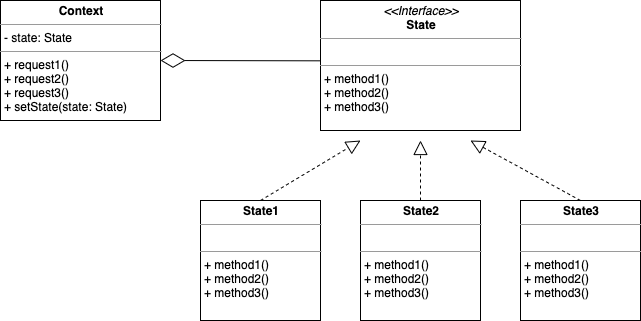

# Chapter 10. 상태 패턴 (State Pattern)

* 객체의 내부 상태가 바뀜에 따라서 객체의 행동을 바꿀 수 있는 패턴이다.
* 상태를 별도의 클래스로 캡슐화하고 현재 상태를 나타내는 컨텍스트 객체가 행동을 위임하기 때문에 새로운 상태를 유연하게 확장할 수 있다.
* 전략 패턴과 같은 구조를 가지고 있다.
  * 하지만 상태 패턴과 전략 패턴은 용도가 다르다.
  * 상태 패턴은 상태 객체에 일련의 행동이 캡슐화된다.
  * 상태 패턴은 상황에 따라 Context 객체에서 여러 상태 객체 중 한 객체에게 모든 행동을 위임하고, Context의 상태가 바뀜에 따라 행동도 바뀌게 된다.
  * 전략 패턴은 일반적으로 클라이언트가 Context 객체에게 어떤 전략 객체를 사용할지 지정해 준다.
  * 전략 패턴은 실행 시에 전략 객체를 변경할 수 있는 유연성을 제공하는 용도로 쓰인다.
