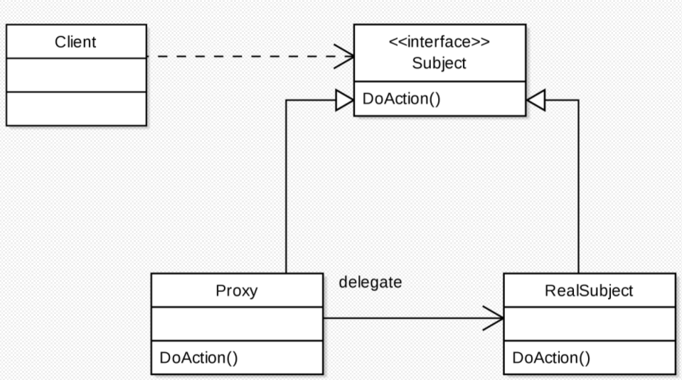
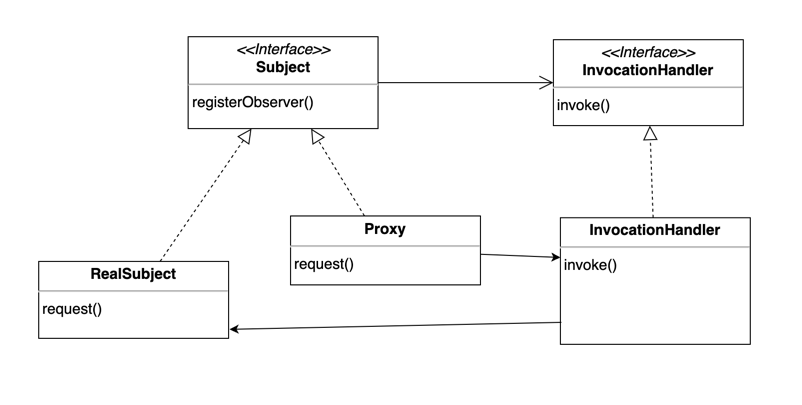

# Chapter 11. 프록시 패턴 (Proxy Pattern)

### 프록시?
* 프록시는 특정 요청에 대해 대리인으로써 전달 받아서 실제 목적지로 전달해주는 역할을 하며, 네트워크 등 여러 분야에서 범용적으로 쓰이는 용어다.
* 클라이언트는 실제 목적지로 보내는 것처럼 행동한다. 하지만 실제로는 프록시를 호출하고 있는 것이다.

### 프록시 패턴

* 프록시 패턴은 특정 객체로의 접근을 제어하는 대리인(특정 객체를 대변하는 객체)를 제공한다.
* Subject는 인터페이스이며, 클라이언트는 이 인터페이스를 통해 원하는 요청에 접근한다.
* Proxy는 대리인 역할을 하며, RealSubject를 컴포지션하여 클라이언트로부터 요청을 받으면 RealSubject로 전달한다.
* Proxy는 RealSubject로의 접근을 제어하는 역할을 한다.

### 프록시 패턴과 데코레이터 패턴 차이점
* 두 차이는 용도로 구분한다.
* 데코레이터는 클래스에 새로운 행동을 추가하는 용도로 쓰인다.
* 프록시는 어떤 클래스로의 접근을 제어하는 용도로 쓰인다.

### 프록시를 생성하는 좋은 방법
* 가장 흔히 쓰이는 기법은 진짜 객체의 인스턴스를 생성해서 리턴하는 팩토리를 사용하는 것이다.
* 팩토리 메서드 내에서 진행되므로 객체를 프록시로 래핑한 다음에 리턴할 수 있다.
* 클라이언트 입장에서는 인터페이스를 바라보고 있기 때문에 프록시 객체인지 실제 객체인지 알 수 없다.

### 어댑터 패턴과도 비슷해보이는데?
* 프록시와 어댑터는 모두 클라이언트와 다른 객체 사이에서 클라이언트의 요청을 다른 객체에게 전달하는 역할을 한다.
* 하지만 어댑터는 다른 객체의 인터페이스로 바꿔주지만, 프록시는 똑같은 인터페이스를 사용한다는 차이점이 있다.
* 어댑터와 비슷한 보호 프록시(Protection Proxy)는 클라이언트의 역할에 따라서 객체에 있는 특정 메서드로의 접근을 제어한다.
  * 따라서 보호 프록시는 클라이언트에게 인터페이스의 일부분만 제공한다.

### 보호 프록시 만들기
* 자바는 java.lang.reflect 패키지 안에 프록시 기능이 내장되어 있다.
* 이 패키지를 사용하면 하나 이상의 인터페이스를 구현하고, 지정한 클래스에 메서드 호출을 전달하는 프록시 클래스를 만들 수 있다.
* 실제 프록시 클래스는 실행 중에 생성되므로 이러한 자바 기술을 동적 프록시(dynamic proxy)라고 한다.

* 다이나믹 프록시는 InvocationHandler를 통해서 프록시 객체를 생성한다.
```java
public interface InvocationHandler {
    Object invoke(Object proxy, Method method, Object[] args)
        throws Throwable;
}
```
* 위 코드는 java.lang.reflect의 InvocationHandler 인터페이스 정의다.
* InvocationHandler는 리플렉션 api에 들어있는 Method 클래스의 getname() 메서드로 프록시의 어떤 메서드가 호출되었는지 알 수 있다.

```java
public interface Person {
    String getName();
    String getGender();

    void setName(String name);
    void setGender(String gender);
    void setGeekRating(int rating);
}

public class PersonImpl implements Person {
    private String name;
    private String gender;
    private int rating;
    private int ratingCount = 0;

    public PersonImpl(String name, String gender) {
        this.name = name;
        this.gender = gender;
        rating = 0;
    }

    @Override
    public String getName() {
        return name;
    }

    @Override
    public String getGender() {
        return gender;
    }

    public int getGeekRating() {
        if (ratingCount == 0) return 0;
        return (rating / ratingCount);
    }

    @Override
    public void setName(String name) {
        this.name = name;
    }

    @Override
    public void setGender(String gender) {
        this.gender = gender;
    }

    @Override
    public void setGeekRating(int rating) {
        this.rating += rating;
        ratingCount++;
    }
}
```
```java
public class OwnerInvocationHandler implements InvocationHandler {
    private Person person;

    public OwnerInvocationHandler(Person person) {
        this.person = person;
    }

    @Override
    public Object invoke(Object proxy, Method method, Object[] args) throws IllegalAccessException {
        try {
            if (method.getName().startsWith("get")) {
                return method.invoke(person, args);
            } else if (method.getName().equals("setGeekRating")) {
                throw new IllegalAccessException();
            } else if (method.getName().startsWith("set")) {
                return method.invoke(person, args);
            }
        } catch (InvocationTargetException e) {
            e.printStackTrace();
        }
        return null;
    }
}
```
```java
public class Main {
    public static void main(String[] args) {
        Person ownerProxy = getOwnerProxy(new PersonImpl("Hello", "Male"));
        System.out.println("이름: " + ownerProxy.getName());

        try {
            ownerProxy.setGeekRating(10);
        } catch (Exception e) {
            System.out.println("본인 프록시에는 호출할 수 없습니다.");
        }
    }

    public static Person getOwnerProxy(Person person) {
        return (Person) Proxy.newProxyInstance(
                person.getClass().getClassLoader(),
                person.getClass().getInterfaces(),
                new OwnerInvocationHandler(person)
        );
    }
}
// 위 결과로 아래와 같은 출력이 결과로 나온다.
// 이름: Hello
// 본인 프록시에는 호출할 수 없습니다.
```
