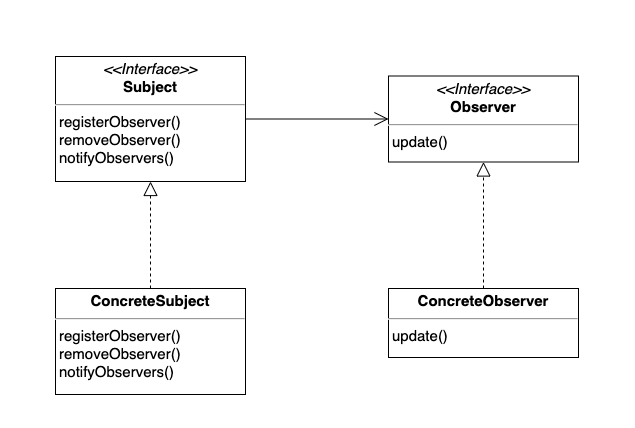
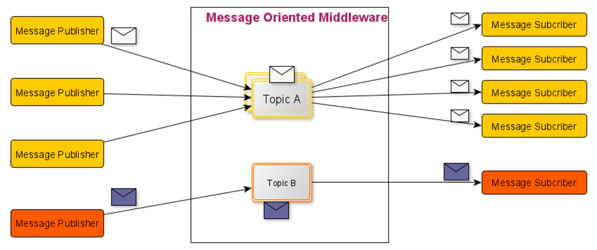

# Chapter 2. 옵저버 패턴 (Observer Pattern)

## 책 예제의 문제 코드
```java
public class WeatherData {
    public void measurementsChanged() {
        float temp = getTemperature();
        float humidity = getHumidity();
        float pressure = getPressure();
        
        currentConditionsDisplay.update(temp, humidity, pressure);
        statisticDisplay.update(temp, humidity, pressure);
        forecastDisplay.update(temp, humidity, pressure);
    }
}
```
* 위 코드는 기상 상태의 변화를 측정하고 해당 결과들을 각 디스플레이에 통지하는 기능이다.

### 새로운 기기가 추가되었을 경우
* 새로운 기기가 추가되었는데, 해당 기기에서도 기상 상태 정보가 필요하게 되었다고 가정하면 위의 코드를 아래와 같이 수정해야한다.
```java
public class WeatherData {
    public void measurementsChanged() {
        float temp = getTemperature();
        float humidity = getHumidity();
        float pressure = getPressure();
        
        currentConditionsDisplay.update(temp, humidity, pressure);
        statisticDisplay.update(temp, humidity, pressure);
        forecastDisplay.update(temp, humidity, pressure);
        newDivice.update(temp, humidity, pressure); // 새로운 기기가 추가되었다.
    }
}
```
* 만약 해당 기기가 필요없어졌을 경우엔 해당 코드를 다시 지우게 될 것이다.
* 이러한 변경의 문제점은 WeatherData 클래스와는 상관이 없는 변경이 이루어지고 있다는 점이다. (SRP 원칙 위배)
* 새로운 기기가 추가될 때마다 코드가 수정이 되어야 하기 때문에 OCP 원칙도 함께 위배되고 있다.

## Observer Pattern
* 특정 오브젝트의 이벤트를 발행하고, Subscriber들이 해당 이벤트를 통지 받을 수 있도록 확장성 있는 구조로 설계하는 패턴이다.
* Subscriber를 더 추가하거나 줄여도 해당 변경 사항이 기존의 Publisher와 Subscriber에게 영향을 주지 않는다.
* 한 객체의 상태가 바뀌면 그 객체에 의존하는 다른 객체에게 통지되고 자동으로 내용이 갱신되는 방식으로 일대다 의존성을 정의한다.


* 옵저버 패턴을 활용하면 Subject와 Observer의 느슨한 결합을 만들 수 있다.
* 느슨한 결합으로 인해 Subject와 Observer의 독립적인 재사용이 가능하다.
* Subject와 Observer가 수정되어도 서로에게 영향을 미치지 않는다.

### 디자인 원칙
> 상호작용하는 객체 사이에는 가능하면 느슨한 결합을 사용해야 한다.

### Publisher-Subscriber 패턴과의 관계?

* 옵저버 패턴과 비슷하지만 Publisher-Subscriber 패턴은 Observer Pattern 보다 더 느슨한 결합을 구현한다.
* Publisher-Subscriber은 Subscriber가 서로 다른 유형의 메시지에 관심을 가질 수 있다.
* 미들웨어 시스템에서 종종 쓰인다.

### 개선해보기
