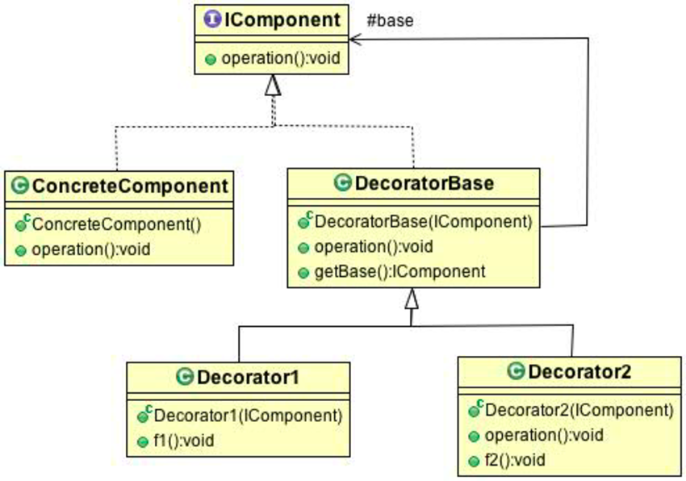

# Chapter 3. 데코레이터 패턴 (Decorator Pattern)

## 데코레이터 패턴

* 타깃에 부가적인 기능을 런타임 시 다이나믹하게 부여해주기 위해 프록시를 사용하는 패턴을 말한다.
* 다이나믹하게 기능을 부가한다는 의미는 컴파일 시점에 어떤 방법과 순서로 프록시와 타깃이 연결되어 사용되는지 정해져 있지 않다는 뜻이다.
* 데코레이터를 활용하면 서브클래스를 만들 때보다 유연하게 기능을 확장할 수 있다.
* 서브클래스를 만드는 방식은 컴파일 할 때 그 행위가 결정되기 때문에 유연한 확장이 어렵다.
* 데코레이터 패턴을 통해 핵심 기능과 부가 기능을 분리하여 기능 구현이 가능하다. (AOP, 트랜잭션 등..)

### 프록시 패턴과 무엇이 다른가?
* 프록시 패턴은 타깃에 대한 접근 방법을 제어하려는 목적을 가진다.
* 프록시는 타깃의 기능을 확장하거나 추가하지 않는다. 대신 클라이언트가 타깃에 접근하는 방식을 변경해준다.

### 디자인 원칙
> 클래스는 확장에는 열려 있어야 하지만 변경에는 닫혀 있어야 한다.

```java
public interface Beverage {
    String getDescription();
    double getCost();
}

public abstract class CondimentDecorator implements Beverage {
    protected Beverage beverage;

    public CondimentDecorator(Beverage beverage) {
        this.beverage = beverage;
    }
}

public class Espresso implements Beverage {
    @Override
    public String getDescription() {
        return "에스프레소";
    }

    @Override
    public double getCost() {
        return 3.5;
    }
}

public class Mocha extends CondimentDecorator {

    public Mocha(Beverage beverage) {
        super(beverage);
    }

    @Override
    public String getDescription() {
        return beverage.getDescription() + ", 모카";
    }

    @Override
    public double getCost() {
        return beverage.getCost() + .5;
    }
}

// 에스프레소, 모카
// 4.0
```

### 데코레이터의 단점
* 데코레이터 패턴은 너무 많은 객체가 추가 될 수 있고, 코드가 복잡해 질 수 있다.
  * 이는 팩토리와 빌더 패턴을 통해 해결할 수 있다.
