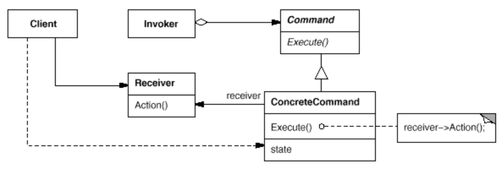

# Chapter 6. 커맨드 패턴 (Command Pattern)

## 커맨드 패턴

* 실행될 기능을 캡슐화하여 재사용성이 높은 클래스로 설계하는 패턴이다. 커맨드를 실행시키는 객체는 커맨드 내부의 요소에 대해서 은닉되어 있으므로 실행될 기능에 대해 유연한 설계가 가능하다.
* 커맨드에 상태 값을 부여하여 커맨드의 메소드가 마지막으로 호출되기 전의 상태로 되돌리는 작업 취소 메소드를 구현하면 커맨드 패턴으로 작업 취소 기능을 구현할 수도 있다.

### 커맨드 패턴 활용
* 커맨드로 컴퓨테이션의 한 부분을 패키지로 묶어서 일급 객체 형태로 전달할 수 있는데, 이를 통해 커맨드 객체를 생성한 뒤에도 재사용이 가능하다. 다른 스레드에서 호출할 수도 있다.
* 스케줄러나 스레드 풀, 작업 큐와 같은 다양한 작업에 적용할 수 있다.
* 로그 및 트랜잭션 시스템을 구현할 수 있다.

### 커맨드 패턴 예시
```java
public interface Executor {
    void execute(Runnable command);
}
```
```java
public class ThreadPoolExecutorExample {
    public static void main(String[] args) {
        ExecutorService executorService = Executors.newFixedThreadPool(10);

        IntStream.iterate(1, i -> i + 1)
                .limit(30)
                .parallel()
                .mapToObj(i -> (Runnable) () -> {
                    try {
                        Thread.sleep(2000);
                        System.out.println(Thread.currentThread().getName() + " : " + i);
                    } catch (InterruptedException e) {
                        throw new RuntimeException(e);
                    }
                })
                .forEach(executorService::execute);

        executorService.shutdown();
    }
}
```
* 스레드 풀은 Runnable을 구현하는 객체를 커맨드로 받아서 캡슐화된 명령을 입력받을 수 있다.

### 선풍기 예시
* as-is
```java
public class CeilingFan {
    public static final int HIGH = 3;
    public static final int MEDIUM = 2;
    public static final int LOW = 1;
    public static final int OFF = 0;
    private String location;
    private int speed;

    public CeilingFan(String location) {
        this.location = location;
        this.speed = OFF;
    }

    public void high() {
        speed = HIGH;
    }

    public void medium() {
        speed = MEDIUM;
    }

    public void low() {
        speed = LOW;
    }

    public void off() {
        speed = OFF;
    }

    public int getSpeed() {
        return speed;
    }
}

public interface Command {
    void execute();
    void undo();
}

public class CeilingFanHighCommand implements Command {
    private CeilingFan ceilingFan;
    private int prevSpeed;

    public CeilingFanHighCommand(CeilingFan ceilingFan) {
        this.ceilingFan = ceilingFan;
    }

    @Override
    public void execute() {
        prevSpeed = ceilingFan.getSpeed();
        ceilingFan.high();
    }

    @Override
    public void undo() {
        if (prevSpeed == CeilingFan.HIGH) {
            ceilingFan.high();
        } else if (prevSpeed == CeilingFan.MEDIUM) {
            ceilingFan.medium();
        } else if (prevSpeed == CeilingFan.LOW) {
            ceilingFan.low();
        } else if (prevSpeed == CeilingFan.OFF) {
            ceilingFan.off();
        }
    }
}
```

* undo()는 if else 로 분기를 통해 되돌리기 명령을 수행하고 있는데, 선풍기의 속도가 새롭게 추가되면 undo 커맨드에도 else if를 추가하여 분기문에 변경이 필요해진다.
* 이는 OCP 원칙을 위배한다.
* 우선 undo는 새로운 커맨드로 객체를 생성하도록 하여 추상화시킨다.

```java
public class CeilingFanHighCommand implements Command {
    private CeilingFan ceilingFan;
    private Command prevSpeedCommand;

    public CeilingFanHighCommand(CeilingFan ceilingFan) {
        this.ceilingFan = ceilingFan;
    }

    @Override
    public void execute() {
        int prevSpeed = ceilingFan.getSpeed();
        if (prevSpeed == CeilingFan.HIGH) {
            prevSpeedCommand = new CeilingFanHighCommand(ceilingFan);
        } else if (prevSpeed == CeilingFan.MEDIUM) {
            prevSpeedCommand = new CeilingFanMediumCommand(ceilingFan);
        } else if (prevSpeed == CeilingFan.LOW) {
            prevSpeedCommand = new CeilingFanHighCommand(ceilingFan);
        } else if (prevSpeed == CeilingFan.OFF) {
            prevSpeedCommand = new CeilingFanHighCommand(ceilingFan);
        }
        ceilingFan.high();
    }

    @Override
    public void undo() {
        prevSpeedCommand.execute();
    }
}
```
* 위와 같이 undo 메서드에 대해서도 Command로 추상화시켰지만 코드는 전혀 나아지지 않았다.
* 커맨드가 추가됨에 따라 중복코드도 계속해서 발생하게 될 것이다..
* prevSpeedCommand에 대해서 너무 많은 else 문으로 객체 생성 코드가 담겨있는 것이 문제인 것 같다.
* 객체의 생성 책임을 분리하여 팩토리로 위임하는 것이 좋을 것 같다.
  * 팩토리 패턴? 팩토리 메서드 패턴?
* prevSpeedCommand는 execute() 메서드가 실행될 때 인스턴스가 생성되므로 팩토리 패턴을 이용해도 적절한 팩토리를 선택하기 위한 분기문이 또 필요하게 될 것 같다.
* speed를 Enum 타입으로 바꾸고 객체 생성의 책임을 그곳으로 몰아보자.

```java
public class CeilingFan {
    public enum Speed {
        HIGH(3) {
            @Override
            Command createCommand(CeilingFan ceilingFan) {
                return new CeilingFanHighCommand(ceilingFan);
            }
        },
        MEDIUM(2) {
            @Override
            Command createCommand(CeilingFan ceilingFan) {
                return new CeilingFanMediumCommand(ceilingFan);
            }
        },
        LOW(1) {
            @Override
            Command createCommand(CeilingFan ceilingFan) {
                return new CeilingFanLowCommand(ceilingFan);
            }
        },
        OFF(0) {
            @Override
            Command createCommand(CeilingFan ceilingFan) {
                return new CeilingFanOffCommand(ceilingFan);
            }
        };
        
        private int val;
        
        Speed(int val) {
            this.val = val;
        }
        
        abstract Command createCommand(CeilingFan ceilingFan);
    }
}
```
* 위와 같이 Speed를 Enum화 시키고, 그 곳에 팩토리 메서드를 정의하여 커맨드 객체를 생성하도록 위임하였다.

```java
public class CeilingFanHighCommand implements Command {
    private CeilingFan ceilingFan;
    private Command prevSpeedCommand;

    public CeilingFanHighCommand(CeilingFan ceilingFan) {
        this.ceilingFan = ceilingFan;
    }

    @Override
    public void execute() {
        CeilingFan.Speed prevSpeed = ceilingFan.getSpeed();
        prevSpeedCommand = prevSpeed.createCommand(ceilingFan);
        ceilingFan.high();
    }

    @Override
    public void undo() {
        prevSpeedCommand.execute();
    }
}

public class CeilingFanLowCommand implements Command {
    private CeilingFan ceilingFan;
    private Command prevSpeedCommand;

    public CeilingFanLowCommand(CeilingFan ceilingFan) {
        this.ceilingFan = ceilingFan;
    }

    @Override
    public void execute() {
        CeilingFan.Speed prevSpeed = ceilingFan.getSpeed();
        prevSpeedCommand = prevSpeed.createCommand(ceilingFan);
        ceilingFan.low();
    }

    @Override
    public void undo() {
        prevSpeedCommand.execute();
    }
}
```
* 그 결과로 execute()에서 커맨드 객체의 생성을 모두 외부로 위임하였고, 복잡한 분기문을 제거했다.
* execute() 메서드에서 각 커맨드마다 아래의 코드가 중복되고 있다.
  * 이 부분은 한 단계 더 추상화하여 제거할 수 있을 것 같지만 아직 지금까지 학습한 디자인 패턴 내용의 범위를 벗어나므로 여기까지하고 마무라한다.

