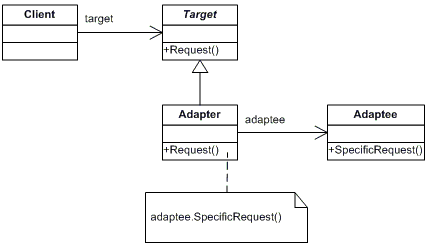
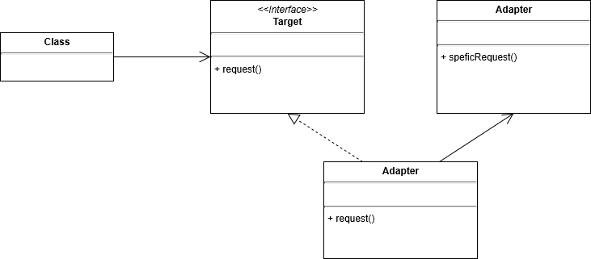

# Chapter 7. 어댑터 패턴과 퍼사드 패턴 (Adapter Pattern and Facade Pattern)

## 어댑터 패턴 (Adapter Pattern)

* 어댑터 패턴은 서로 다른 인터페이스에 대해서 인터페이스가 다르더라도 서로 연결할 수 있도록 중간자 역할을 구현하는 패턴이다.
* 어댑터 덕분에 인터페이스가 호환되지 않는 인터페이스를 사용하는 클라이언트를 그대로 활용할 수 있다.
* 클라이언트와 구현된 인터페이스를 분리할 수 있으며, 인터페이스가 변경되더라도 어댑터에 캡슐화되어 있기 때문에 클라이언트를 수정할 필요가 없다.

```java
public interface Foo {
    void greeting();
}

public class FooImpl implements Foo {
    @Override
    public void greeting() {
        System.out.println("Greeting! This is foo!");
    }
}
```
```java
public interface Bar {
    void hello();
}

public class BarImpl implements Bar {

    @Override
    public void hello() {
        System.out.println("Hello! I'm Bar!");
    }
}
```
```java
public class BarAdapter implements Foo {
    private Bar bar;

    public BarAdapter(Bar bar) {
        this.bar = bar;
    }

    @Override
    public void greeting() {
        bar.hello();
    }
}
```
```java
public class App {
    public static void main(String[] args) {
        Foo foo = new BarAdapter(new BarImpl());
        foo.greeting();
    }
}
```

### 객체 어댑터와 클래스 어댑터
* 객체 어댑터는 위의 다이어 그램과 같이 컴포지션을 활용한다.
* 클래스 어댑터는 다중 상속을 통해 타겟과 어댑티 모두 서브클래스로 만들어 사용한다.

* 자바에서는 다중 상속을 지원하지 않으므로 사용되지 않는다.
* 클래스 어댑터는 상속을 이용하기 때문에 그 확장성이 컴포지션을 활용하는 객체 어댑터보다 떨어진다.

### 어댑터 패턴의 예시
* Spring MVC에서 Request를 처리하기 위한 HandlerAdapter
```java
class DispatcherServlet {
    private List<HandlerAdapter> handlerAdapters;

    protected HandlerAdapter getHandlerAdapter(Object handler) throws ServletException {
        // Determine whether handlerAdapters are empty
        if (this.handlerAdapters != null) {
            // If not empty, traverse handlerAdapters 
            Iterator var2 = this.handlerAdapters.iterator();

            while(var2.hasNext()) {
                HandlerAdapter adapter = (HandlerAdapter)var2.next();
                // After reading the source code of HandlerAdapter, you will find that there is a method in HandlerAdapter
                // It's supports, and the method here is in HandlerAdapter
                // This is to determine whether the adapter processor supports this processor
                if (adapter.supports(handler)) {
                    // If supported, return this adapter processor
                    return adapter;
                }
            }
        }

        throw new ServletException("No adapter for handler [" + handler + "]: The DispatcherServlet configuration needs to include a HandlerAdapter that supports this handler");
    }
}
```

### 데코레이터 패턴과 어댑터 패턴
* 데코레이터 패턴은 새로운 책임과 행동을 추가한다.
* 어댑터 패턴은 서로 호환되지 않는 인터페이스를 중간에서 변환하여 호환 가능하도록 변환하는 역할을 한다.

## 퍼사드 패턴 (Facade Pattern)
* 앞서 살펴본 어댑터 패턴은 호환되지 않는 두 인터페이스를 어댑터 통해 변환하여 외부 인터페이스를 캡슐화했다.
* 퍼사드 패턴은 인터페이스를 단순하게 바꾸기 위해 인터페이스를 변환한다. (퍼사트는 겉모양이나 외관이라는 뜻이다.)
* 퍼사드 패턴은 하나 이상의 클래스 인터페이스를 단순하게 바꾼다.
* 퍼사드는 서브시스템 클래스를 캡슐화하지 않는다. 망냑 특정 서브시스템 클래스가 필요로 한다면 그냥 사용하면 된다.
* 퍼사드를 사용하면 클라이언트 구현과 서브시스템을 분리할 수 있다.
* 어댑터와 퍼사드의 차이점은 감싸는 클래스의 개수가 아니라 그 용도에 있다.
  * 어댑터 패턴은 클라이언트에서 필요로 하는 인터페이스로 변환하는 용도로 쓰인다.
  * 퍼사드 패턴은 어떤 서브시스템에 대한 간단한 인터페이스를 제공하는 용도로 쓰인다.

### 디자인 원칙
* 최소 지식 원칙 (Principle of Least Knowledge)
> 객체 사이의 상호작용은 될 수 있으면 가까이에 위치한 객체와만 허용하는 것이 좋다.
* 이 원칙을 준수하면 여러 클래스가 복잡하게 얽혀서 한 부분을 변경했을 때 다른 부분까지 줄줄이 수정해야 하는 상황을 방지할 수 있다.
* 데메테르의 법칙이라고도 한다.

### 최소 지식 원칙을 준수하는 방법
* 아래의 요소에 대해서 의존적으로 코드를 작성해야 한다.
  * 객체 자체
  * 메소드에 매개변수로 전달된 객체
  * 메소드로 인스턴스를 만든 객체
  * 객체에 속하는 구성 요소

```java
// 원칙을 따르지 않은 경우
class Example {
    public float getTemp() {
        Thermometer thermometer = station.getThermometer();
        return thermometer.getTemperature();
    }
}
```
```java
// 원칙을 따르는 경우
class Example {
    public float getTemp() {
        return station.getTemperature();
    }
}
```
```java
public class Car {
    Engine engine;  // 이 클래스의 구성 요소. 이 구성 요소의 메서드는 호출해도 된다.
    
    public Car() {
        // Engine 초기화 등을 처리
    }
    
    public void start(Key key) {
        Doors doors = new Doors();  // 새로운 객체를 생성한다. 이 객체의 메서드는 해출해도 된다.
        boolean authorized = key.turns();   // 매개변수로 전달된 객체의 메서드는 호출해도 된다.
        if (authorized) {
            engine.start(); // 이 객체의 구성 요소를 대상으로 메서드를 호출해도 된다.
            updateDashboardDisplay();   // 객체 내에 있는 메서드는 호출해도 된다.
            doors.lock();   // 직접 생성하거나 인스턴스를 만든 객체의 메서드는 호출해도 된다.
        }
    }
    
    public void updateDashboardDisplay() {
        // Do something...
    }
}
```

### 퍼사드 패턴의 예시
* SLF4J (Simple Logging Facade for Java)
  * java.util.logging, logback, log4j와 같은 다양한 로깅 프레임워크에 대한 추상화를 제공한다.
  * 개발자는 이러한 퍼사드 덕분에 로깅 모듈을 교체하더라도 로깅 관련 코드를 수정하지 않아도 된다.
