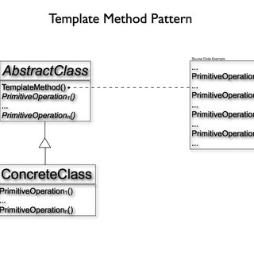

# Chapter 8. 템플릿 메서드 패턴 (Template Method Pattern)

## 템플릿 메서드 패턴

* 알고리즘의 일부 단계를 서브클래스에서 구현하고, 알고리즘의 구조는 그대로 유지하면서 알고리즘의 특정 단계를 서브 클래스에서 재정의 할 수 있다.
* 서브클래스가 일부분의 구현을 정의하여 알고리즘의 구조를 바꾸지 않아도 된다.
* 훅(hook)은 추상 클래스에 선언되어 있지만 기본적인 내용만 구현되어 있거나 아무 코드도 들어있지 않은 메서드다.
* 훅은 서브클래스에서 훅을 오버라이드하여 원하는 기능으로 재정의할 수 있다.

```java
public abstract class AbstractFoo {

    public void doSomething() {
        greeting();
        introduce();
        bye();
    }

    private void greeting() {
        System.out.println("Greeting!");
    }

    protected abstract void introduce();

    private void bye() {
        System.out.println("Bye!");
    }
}

public class FooImpl extends AbstractFoo {
    @Override
    protected void introduce() {
        System.out.println("My name is FooImpl");
    }
}
```
* 추상 클래스를 서브클래스에서 구현하여 나머지 알고리즘을 정의한다.

```java
public class FunctionalFoo {

    public void doSomething(Runnable runnable) {
        greeting();
        runnable.run();
        bye();
    }

    private void greeting() {
        System.out.println("Greeting!");
    }

    private void bye() {
        System.out.println("Bye!");
    }
}
```
* 함수형 프로그래밍을 이용하면 서브클래스를 새로 생성하지 않고도 템플릿 메서드를 구현할 수 있다.

```java
public class App {
    public static void main(String[] args) {
        AbstractFoo foo = new FooImpl();
        foo.doSomething();

        FunctionalFoo functionalFoo = new FunctionalFoo();
        functionalFoo.doSomething(() -> System.out.println("Hello!! I'm FunctionalFoo"));
    }
}
```

### 추상 메서드와 후크의 용도를 어떻게 구별할 수 있는가?
* 서브클래스가 알고리즘의 특정 단계를 제공해야 한다면 추상 메서드를 사용해야 한다.
* 알고리즘의 특정 단계가 선택적으로 적용된다면 훅을 사용한다.

## 할리우드 원칙 (Hollywood Principle)
* 할리우드 원칙이란 부모 클래스는 서브클래스에 정의된 연산을 호출할 수 있지만 반대 방향의 호출은 안 된다는 의미이다.
* 템플릿 메서드는 할리우드 원칙이라는 역전된 제어 구조를 끌어낸다.
* 할리우드 원칙은 의존성 부패(Dependency Rot)을 방지한다.
* 의존성 부패란 고수준 구성 요소가 저수준 구성 요소에 의존하고, 그 저수준 구성 요소는 다시 고수준 구성 요소에 의존하고, 그 고수준 구성 요소는 다시 또 다른 구성 요소에 의존하는 것과 같이 의존성이 복잡하게 꼬여있는 상황을 말한다.
* 할리우드 원칙을 사용하면 저수준 구성 요소가 시스템에 접속할 수는 있지만 언제, 어떻게 그 구성 요소를 사용할지는 고수준 구성 요소가 결정한다.

## 템플릿 메서드의 활용
* 대표적으로 Arrays 클래스의 sort()가 있다.
* 배열의 객체는 Comparable 인터페이스를 구현하여 대소 비교 방법을 구현함으로써 정렬이 가능해진다.
* 또 다른 예로는 InputStream에 있는 read()가 있다. read()는 서브 클래스에서 구현해야 한다.

## 템플릿 메서드 패턴과 전략 패턴
* 전략 패턴과 템플릿 메서드 패턴은 알고리즘을 캡슐화하는 패턴이다.
* 템플릿 메서드 패턴은 서브 클래스에서 일부 구현 부분을 제공해야 한다.
* 전략 패턴은 객체 레퍼런스로 참조하여 구성하는 클래스에서 알고리즘을 완전히 제공한다.
* 템플릿 메서드 패턴은 부모 클래스의 구현부에 의존해야 하므로 전략 패턴보다는 유연성이 떨어진다.
