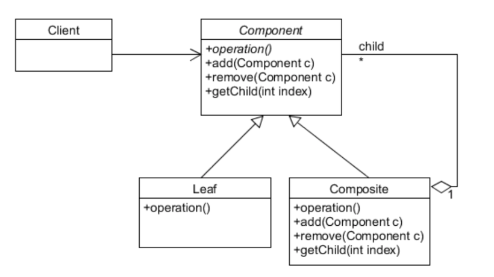

# Chapter 9. 반복자 패턴과 컴포지트 패턴

## 반복자 패턴 (Iterator Pattern)
* 컬렉션의 구현 방법을 노출시키지 않으면서 집합체 내의 모든 항목에 접근하는 방법을 제공하는 패턴이다.
* Iterator 인터페이스에 의존한다.
```java
interface Iterator<T> {
    boolean hasNext();
    T next();
}
```
* Iterator를 구현하고 있다면, 순회 가능한 집합체의 내부 구현 내용을 외부로 노출하지 않으면서 유연한 반복자 제공이 가능하다.
* Iterator에 정의된 remove()는 멀티스레드에서 컬렉션에 동시에 접근할 떄 사이드 이펙트를 주의해야 한다.
* 각 항목에 일일이 접근할 수 있게 해주는 기능을 집합체가 아닌 반복자 객체가 책임진다는 장점이 있다.
  * 집합체 인터페이스와 구현이 간단해지고, 책임 분리를 통해 각자의 역할에 충실할 수 있다.
* Iterator에는 정해진 순서가 없는 컬렉션일 수도 있으므로 순서가 무조건 있을거라는 가정을 해서는 안된다.

### 디자인 원칙
> 어떤 클래스가 바뀌는 이유는 하나뿐이어야 한다.

### Iterable 인터페이스
* 자바의 모든 컬렉션 유형은 Iterable 인터페이스를 구현한다.
* Iterable을 구현하면 iterator() 메서드를 구현한다.
* iterator() 메서드는 Iterator 인터페이스를 구현하는 반복자를 리턴한다.
* Iterable 인터페이스는 컬렉션에 있는 항목을 대상으로 반복 작업을 수행하는 방법을 제공하는 forEach() 메서드가 기본으로 제공된다.
* 향상된 for문으로 편리한 문법적 기능을 제공한다.

```java
public class Foo {
  private String name;

  public Foo(String name) {
    this.name = name;
  }

  public String getName() {
    return name;
  }
}

public class FooIterator implements Iterable<Foo> {
  private List<Foo> foos;
  private int position = 0;

  public FooIterator(List<Foo> foos) {
    this.foos = foos;
  }

  @NotNull
  @Override
  public Iterator<Foo> iterator() {
    return foos.iterator();
  }
}
```
```java
public class IteratorSimpleMain {
    public static void main(String[] args) {
        List<Foo> foos = List.of(
                new Foo("hello"),
                new Foo("World"),
                new Foo ("goodbye")
        );

        FooIterator fooIterator = new FooIterator(foos);

        for (Foo foo : fooIterator) {
            System.out.println(foo.getName());
        }
    }
}
```

## 컴포지트 패턴 (Composite Pattern)

* 객체를 트리 구조로 구성하여 부분-전체 계층 구조를 구현한다.
* 컴포지트 패턴은 클라이언트에서 개별 객체와 복합 객체를 똑같은 방법으로 다룰 수 있다.
```java
public abstract class FooComponent {
    public String getName() {
        throw new UnsupportedOperationException();
    }
}

public class Foo extends FooComponent {
  private List<FooComponent> fooComponents;
  private String name;

  public Foo(List<FooComponent> fooComponents, String name) {
    this.fooComponents = fooComponents;
    this.name = name;
  }

  @Override
  public String getName() {
    return name + "\n" +
            fooComponents.stream()
                    .map(FooComponent::getName)
                    .collect(Collectors.joining(", "));
  }
}

public class SubFoo extends FooComponent{
  private String name;

  public SubFoo(String name) {
    this.name = name;
  }

  @Override
  public String getName() {
    return name;
  }
}
```
```java
public class SimpleMain {
    public static void main(String[] args) {
        FooComponent foo = new Foo(
                List.of(
                        new SubFoo("Sub Hello"),
                        new SubFoo("Sub World")
                ),
                "Foo Hello World!"
        );

        System.out.println(foo.getName());
    }
}
```
* 컴포지트 패턴은 한 클래스에서 한 역할만 맡아야 한다는 단일 역할 원칙을 깨는 대신 투명성을 확보하는 패턴이다.
* 투명성(transparency)은 컴포넌트 인터페이스에 복합 객체와 단일 객체를 똑같은 방식으로 처리할 수 있도록 하는 성질이다.
* 두 종류의 기능이 함께 존재하기 때문에 안정성은 떨어질 수 있다. (상황에 따라서 투명성과 안정성 사이에 트레이드 오프를 잘 고려해야 한다.)
* 컴포지트 패턴은 클라이언트 코드를 단순화 시킬 수 있다.
